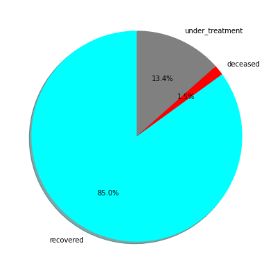

# Covid-19 Data Visualization

 Visualizing daily covid-19 update in India 

<ul>
   <li>Collecting real covid-19 data from <a href="https://api.covid19india.org/">covid19india api</a></li>
   <li>Parsing JSON data in a suitable format for visualization</li>
</ul>

### Time series data plot

### Covid-19 cases distribution

