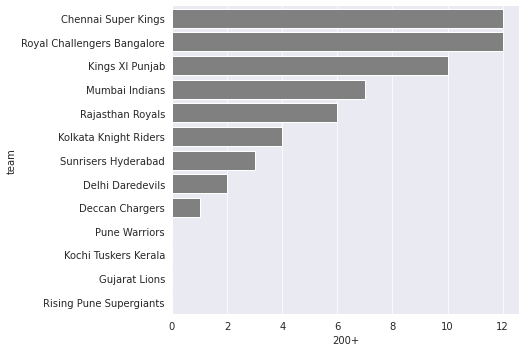
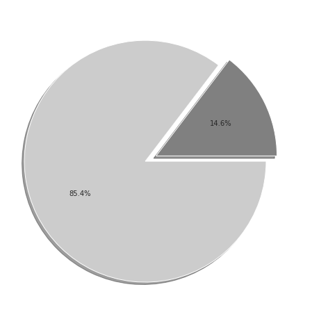
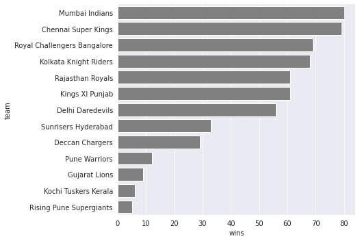
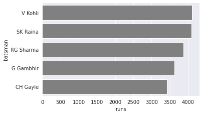
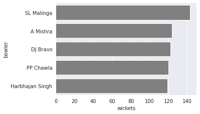

# IPL Data Analysis

### Number of times each team have made 200+ runs

### What are the chances that a team scoring runs above 200 in their 1st inning is chased by the opposition in 2nd inning.

### Plot top 5 teams with highest win counts across all seasons

### Plot the top 5 run scorers across all seasons

### Plot the top 5 wicket takers across all seasons

