# Insurance claim Status Prediction

Insurance companies take risks over customers. Risk management is a very important aspect of the insurance industry. Insurers consider every quantifiable factor to develop profiles of high and low insurance risks. Insurers collect vast amounts of information about policyholders and analyse the data.
As a Data scientist in an insurance company, you need to analyse the available data and predict whether to sanction the insurance or not

## About Dataset

<table>
    <tr>
       <th>Feature</th>
       <th>Description</th>
    </tr>
    <tr>
       <td>ID</td>
       <td>Unique identifier</td>
    </tr>
    <tr>
       <td>Agency</td>
       <td>Agency name</td>
    </tr>
    <tr>
       <td>Agency Type</td>
       <td>Type of travel insurance agency</td>
    </tr>
    <tr>
       <td>Distribution Channel</td>
       <td>Online/Offline distribution channel</td>
    </tr>
    <tr>
       <td>Product Name</td>
       <td>Travel insurance product name</td>
    </tr>
    <tr>
       <td>Duration</td>
       <td>Duration of travel</td>
    </tr>
    <tr>
       <td>Destination</td>
       <td>Destination of travel</td>
    </tr>
    <tr>
       <td>Net sales</td>
       <td>Net sales of travel insurance policies </td>
    </tr>
    <tr>
       <td>Commision</td>
       <td>The commission received by travel insurance agency </td>
    </tr>
    <tr>
       <td>Gender</td>
       <td>Traveller's gender</td>
    </tr>
    <tr>
       <td>Age</td>
       <td>Traveller's Age </td>
     </tr>
</table>

## EDA and Preprocessing

### Null values in %

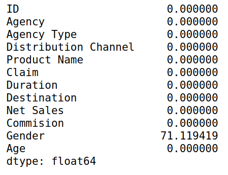

 Dropped Gender and ID column 

## Analyze Categorical columns

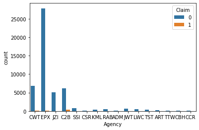

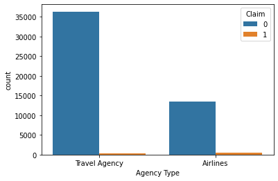

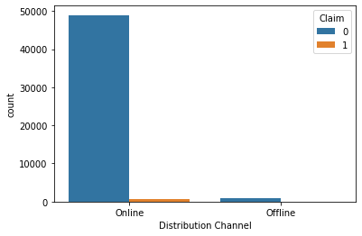

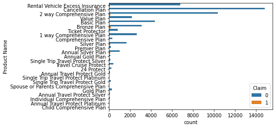

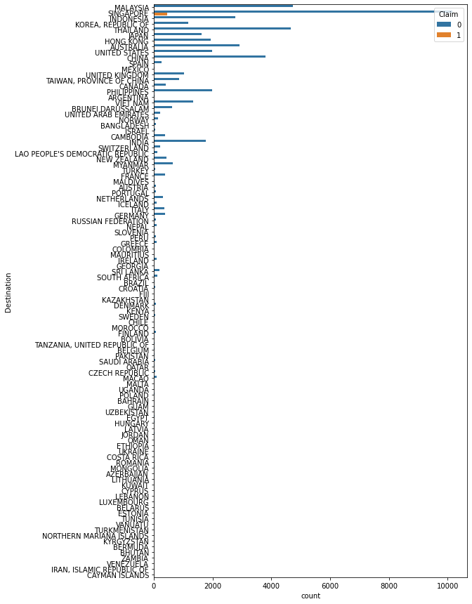

 Dropped Dristribution channel (Highly imbalanced) and Destinations (Too many classes) 

## Analyze Numerical columns

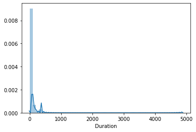

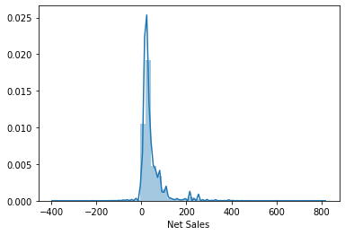

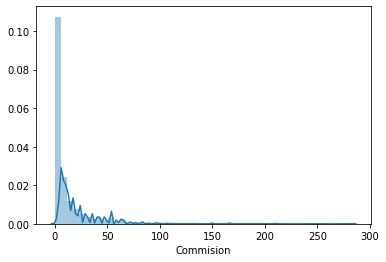

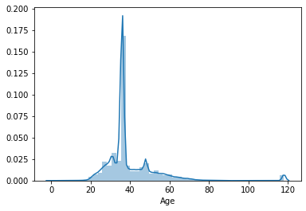

 Replaced duration values < 0 with average duration of their respective destination 
   

## Bivariate Analysis againts the traget

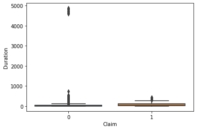

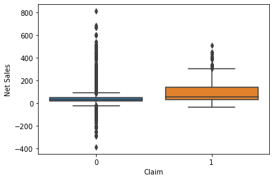
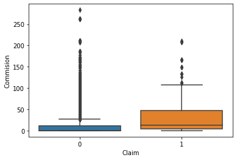
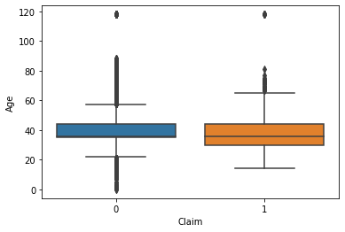

## Baseline model

 Decision Tree Classifier

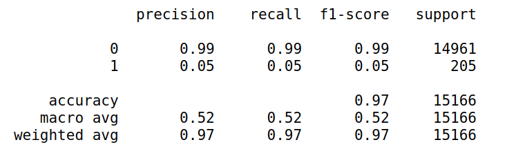

## Neural Network

 Standardization using <b>StandardScaler</b> 

 Since the target is highly imbalanced, used <b>RandomOverSampler</b> 

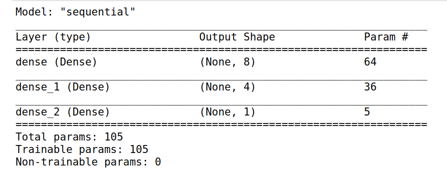

