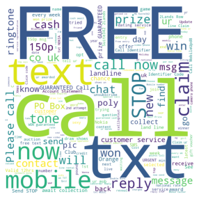
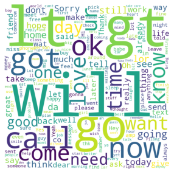

# SPAM SMS PREDICTION

 Goal: Build an application (end to end) that predicts if an SMS is spam or not 

## EDA and Preprocessing

Wordcloud plot for spam sms

 Highly used words in spam sms are - FREE, text, call, txt etc.

Wordcloud plot for non-spam sms

