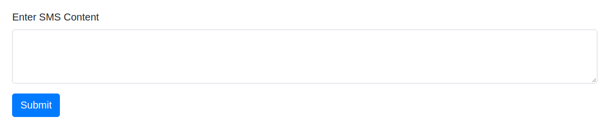

# SPAM SMS PREDICTION

 Goal: Build an application (end to end) that predicts if an SMS is spam or not 

## EDA and Preprocessing

Wordcloud plot for spam sms

 Highly used words in spam sms are - FREE, text, call, txt etc.

Wordcloud plot for non-spam sms

## Text preprocessing

 Stopwords and punctuation removal using <b>nltk</b> library 

 Text vectorization using <b>TFIDF-Vectorizer</b> 

## Model

 Decision Tree 

 Precision for spam sms is 0.92, that means very few non-spam sms have been predicted as spam sms. Recall is 0.79, that means out of all actual spam sms, 79% have been predicted as spam accurately. 

## Deploying model

 Saved the model in a file using pickle library 

 Developed a web application using Flask API 

 Containarized the application using Docker 

